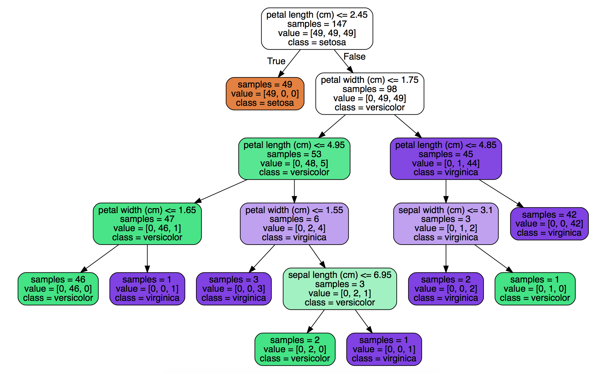
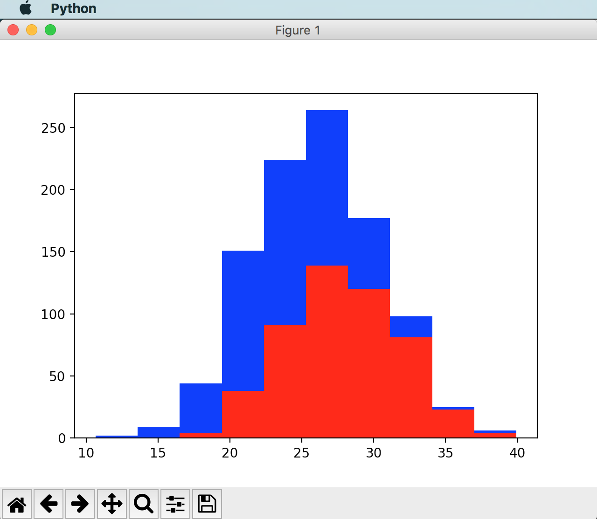

# MLTensorFlow
 
 

TensorFlow

Develop OCR and Supervised Learning applications using TensorFlow, Scikit and Graphviz 
Make use of deep learning to train classifiers to learn to recognise and predict from images and data instead of using conditional rules.

References:
TensorFlow Applications
Machine Learning Tutorials Playlist https://www.youtube.com/watch?v=Gj0iyo265bc&list=PLOU2XLYxmsIIuiBfYad6rFYQU_jL2ryal

#Set ups

brew install python3
brew install graphviz
pip3 install numpy
pip3 install pydotplus
pip3 install matplotlib
pip3 install scipy

##if there is error use: 
sudo pip3 install pydotplus --upgrade --ignore-installed six

## if current release of matplotlib doesn't support python3
git clone https://github.com/matplotlib/matplotlib
cd matplotlib
python3 setup.py build
sudo python3 setup.py install

python3 2UseIrisDataset.py
open -a preview iris.pdf

###Avoid redundant to have highly correlated features 
###e.g. Height in inches and height in cm 

